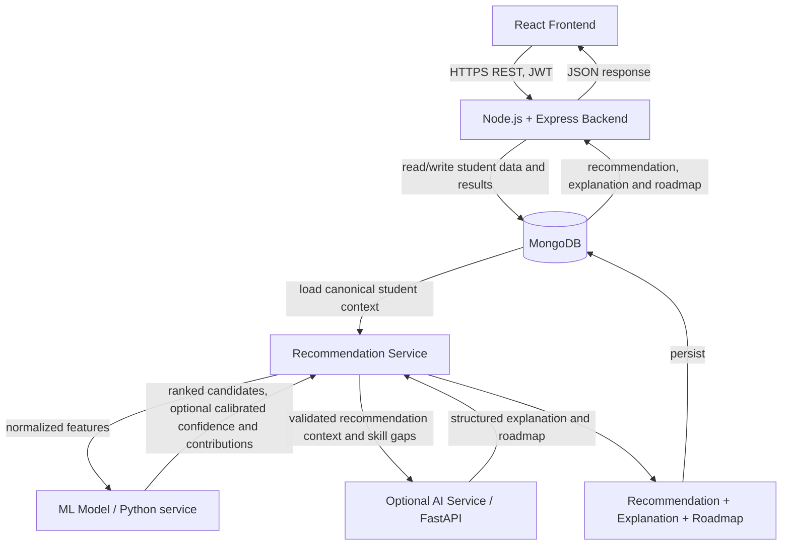

# F-096 API and Data Contract

**Status:** Proposed contract; no backend, database, ML service, or AI service is implemented yet.
**API prefix:** `/api`
**Examples:** Synthetic only. Identifiers, grades, skills, and student details below are fabricated for contract illustration.

This document is the integration source of truth for the React client and future Node.js/Express backend. It describes intended behavior, not existing endpoints. API versioning can be added as `/api/v1` before the first external release if the team needs multiple supported contracts; this initial prototype uses the requested `/api` prefix.

## 1. System Architecture



The requested linear diagram is a logical data flow, not a requirement that MongoDB call services: the backend/recommendation service reads and writes MongoDB, then calls ML and, optionally, AI. ML and AI are internal services; the browser must not call them directly. If an AI provider is unavailable, recommendation generation may still return results with explanation or roadmap marked unavailable/pending.

## 2. Contract Conventions

- JSON uses `camelCase`; timestamps are UTC ISO 8601 strings, for example `2026-10-01T09:30:00Z`.
- IDs are opaque strings generated by the backend. Clients must not infer meaning from them.
- A successful response uses `{ "success": true, "data": ... }`. Paginated responses also include `meta.pagination`.
- An error always uses the single format in [Error Format](#8-error-format).
- Request/response schemas below use JSON-like types: `string`, `number`, `boolean`, `null`, arrays (`T[]`), and objects. `number` values must be finite; percentages are explicitly on a 0–100 scale, while normalized model confidence is 0–1.
- “Required” means required in that entity when it is returned or stored, unless the row identifies a conditional field. APIs may return `null` for explicitly unavailable results; they must not fabricate a value to satisfy a field.
- Student-facing endpoints scope data to the authenticated user. The client never chooses another student's profile by submitting a profile ID.
- ERP-verified values are authoritative only when obtained from a trusted ERP connector/import path. Request data from the browser is not proof of ERP identity, enrollment, or grades.

## 3. Data Entities

The following are logical API entities, not code or MongoDB schemas. Examples are all synthetic. Nested arrays are described separately where useful.

### StudentProfile

Profile-owned identity and student-editable preferences. Academic records remain in `StudentERPData`; uploaded file metadata remains in `ResumeData`.

| Field | Type | Required? | Synthetic example | Purpose |
|---|---|---:|---|---|
| `id` | string | Yes | `profile_demo_001` | Backend-generated profile ID. |
| `userId` | string | Yes | `user_demo_001` | Owning authenticated account. |
| `displayName` | string | Yes | `Mira Example` | Name shown in the student UI; synthetic. |
| `college` | string | Yes | `Example Technical Institute` | Institution label. |
| `erpRecordId` | string or null | No | `erp_demo_001` | Link to the latest ERP snapshot, if linked. |
| `resumeId` | string or null | No | `resume_demo_001` | Link to the latest resume metadata, if uploaded. |
| `skills` | `StudentSkills[]` | Yes | See [StudentSkills](#studentskills) | Student-entered and verified skill records. Empty array is valid. |
| `interests` | `StudentInterests[]` | Yes | See [StudentInterests](#studentinterests) | Declared domains/interests. Empty array is valid. |
| `preferences` | object | Yes | `{ "preferredCareer": "Cloud Developer", "preferredDomains": ["Web Development"], "weeklyStudyHours": 8, "learningPace": "BALANCED" }` | Persistent recommendation defaults; fields are detailed below. |
| `createdAt` | string (date-time) | Yes | `2026-10-01T09:00:00Z` | Creation timestamp. |
| `updatedAt` | string (date-time) | Yes | `2026-10-01T09:30:00Z` | Last profile update timestamp. |

`preferences.preferredCareer` is an optional string; `preferredDomains` is a string array; `weeklyStudyHours` is an optional positive integer; `learningPace` is optional `SELF_PACED`, `BALANCED`, or `INTENSIVE`. The profile response may aggregate linked ERP and resume data for frontend convenience, but those remain separate entities and sources of truth.

### StudentERPData

An ERP synchronization snapshot. The backend should preserve source and sync metadata. Fields obtained from an ERP must not be editable through the student profile form.

| Field | Type | Required? | Synthetic example | Purpose |
|---|---|---:|---|---|
| `id` | string | Yes | `erp_demo_001` | Backend-generated snapshot ID. |
| `profileId` | string | Yes | `profile_demo_001` | Owning student profile. |
| `source` | string | Yes | `SKIT_ERP` | Configured institution/source identifier, not a secret. |
| `externalStudentId` | string | Yes | `SYN-2026-0042` | Synthetic institution record key. Treat as sensitive. |
| `branch` | string | Yes | `Computer Science (IoT)` | ERP-reported program/branch. |
| `section` | string or null | No | `A-G2` | ERP-reported section where available. |
| `semester` | integer | Yes | `6` | Current semester. |
| `academicYear` | string | Yes | `2023-2027` | Program cohort/year range or institution-defined academic year. |
| `cgpa` | number | Yes | `8.4` | Cumulative grade-point average, with scale defined by `cgpaScale`. |
| `cgpaScale` | number | Yes | `10` | Maximum CGPA scale, avoiding assumptions about grading systems. |
| `attendancePercent` | number or null | No | `89.4` | Attendance percent (0–100), if supplied and approved for use. |
| `subjects` | `ERPSubject[]` | Yes | One subject: `{ "courseCode": "SYN-CS301", "name": "Web Systems", "semester": 5, "credits": 4, "score": 86, "grade": "A", "attendancePercent": 91 }` | Course evidence available to recommendations. Empty array is valid. |
| `syncStatus` | string | Yes | `SYNCED` | `SYNCED`, `FAILED`, or `PENDING`. |
| `syncedAt` | string (date-time) or null | No | `2026-10-01T09:20:00Z` | Last successful synchronization time. |
| `createdAt` | string (date-time) | Yes | `2026-10-01T09:20:00Z` | Snapshot creation time. |

Each `ERPSubject` has `courseCode: string` (required; synthetic example `SYN-CS301`), `name: string` (required; `Web Systems`), `semester: integer` (required; `5`), `credits: number` (required; `4`), `score: number | null` (optional; `86`, on a documented 0–100 scale), `grade: string | null` (optional; `A`), and `attendancePercent: number | null` (optional; `91`, 0–100). Purpose: preserve the per-course academic evidence used by the recommendation service. Institutions may need a mapping layer where their ERP schema differs.

### StudentSkills

`StudentSkills` is an array of skill records embedded in a profile and included as a normalized feature list for recommendation requests.

| Field | Type | Required? | Synthetic example | Purpose |
|---|---|---:|---|---|
| `name` | string | Yes | `TypeScript` | Skill/tool label. |
| `level` | string | Yes | `INTERMEDIATE` | `BEGINNER`, `INTERMEDIATE`, `ADVANCED`, or `UNKNOWN`; self-assessed level is not equivalent to verified proficiency. |
| `source` | string | Yes | `SELF_REPORTED` | `SELF_REPORTED`, `ERP_COURSEWORK`, or `RESUME_PARSED`. |
| `verificationStatus` | string | Yes | `UNVERIFIED` | `VERIFIED`, `UNVERIFIED`, or `PENDING_REVIEW`. |
| `updatedAt` | string (date-time) | Yes | `2026-10-01T09:25:00Z` | Last update time. |

### StudentInterests

`StudentInterests` is an array of profile preference records.

| Field | Type | Required? | Synthetic example | Purpose |
|---|---|---:|---|---|
| `domain` | string | Yes | `Web Development` | Student-selected interest area. |
| `priority` | integer | Yes | `1` | Student-defined order, starting at 1; unique within a profile. |
| `source` | string | Yes | `STUDENT_SELECTED` | `STUDENT_SELECTED` or `INFERRED`; inferred values must be labeled as such. |

### ResumeData

Metadata and extracted fields only. The original file should be stored in controlled file/object storage, not returned from the API or placed in a public MongoDB field.

| Field | Type | Required? | Synthetic example | Purpose |
|---|---|---:|---|---|
| `id` | string | Yes | `resume_demo_001` | Backend-generated resume record ID. |
| `profileId` | string | Yes | `profile_demo_001` | Owning profile. |
| `fileName` | string | Yes | `sample_resume.pdf` | Client-provided display name; sanitize before display. |
| `contentType` | string | Yes | `application/pdf` | Validated MIME type. |
| `sizeBytes` | integer | Yes | `245760` | Validated uploaded size. |
| `status` | string | Yes | `PROCESSING` | `UPLOADED`, `PROCESSING`, `PROCESSED`, or `FAILED`. |
| `extractedSkills` | object[] | Yes | `[{ "name": "Python", "confidence": null }]` | Extracted skills; confidence is null unless the parser provides a defined, validated score. |
| `uploadedAt` | string (date-time) | Yes | `2026-10-01T09:28:00Z` | Upload timestamp. |
| `processedAt` | string (date-time) or null | No | `null` | Parsing completion time, if processed. |

Each extracted skill has `name: string` (required; `Python`) and `confidence: number | null` (optional; `null`, otherwise a parser score on 0–1 whose meaning is documented). Resume text and internal storage keys are not exposed in ordinary profile responses.

### Recommendation

One ranked stack candidate from a recommendation run. `confidence.value` is null when no valid model confidence exists. A rule-based ranking is not to be described as ML confidence.

| Field | Type | Required? | Synthetic example | Purpose and origin |
|---|---|---:|---|---|
| `id` | string | Yes | `rec_demo_001` | Backend-generated record ID. **Backend-generated.** |
| `profileId` | string | Yes | `profile_demo_001` | Owner; do not expose another student's record. **Backend-generated.** |
| `runId` | string | Yes | `run_demo_001` | Groups candidates from one request. **Backend-generated.** |
| `generatedAt` | string (date-time) | Yes | `2026-10-01T09:35:00Z` | Creation time. **Backend-generated.** |
| `generationMode` | string | Yes | `RULE_BASED` | `ML`, `RULE_BASED`, or `UNAVAILABLE`. Describes the actual method used. **Backend-generated from service result.** |
| `model` | object or null | Yes | `null` | Model metadata only when an ML model actually ran. **ML-generated metadata.** |
| `stack` | object | Yes | `{ "title": "Web Application Stack", "category": "WEB", "technologies": [{ "name": "React", "category": "Frontend" }] }` | Normalized stack result. **ML-generated or rule-based; record provenance.** |
| `confidence` | object | Yes | `{ "value": null, "status": "NOT_AVAILABLE", "scale": "0_TO_1" }` | Calibrated confidence only; never substitute a fabricated percentage. **ML-generated or unavailable.** |
| `ranking` | object | Yes | `{ "position": 1, "total": 3 }` | Candidate ordering within this run. **Backend-generated** from model scores or a documented deterministic rule. |
| `reasons` | object[] | Yes | `[{ "text": "The declared web interest aligns with this stack.", "source": "RULE_BASED" }]` | Human-readable reason statements. **Rule-based, ML-derived, or AI-generated**, identified per item. |
| `skillGaps` | object[] | Yes | `[{ "skill": "Docker", "importance": "SUGGESTED" }]` | Skills to learn or strengthen. **Rule-based or ML-derived**; not a claim that student lacks a skill unless profile evidence supports it. |
| `explanationRef` | string or null | No | `explanation_demo_001` | Explanation resource identifier, if available. **Backend-generated.** |
| `roadmapRef` | string or null | No | `roadmap_demo_001` | Roadmap resource identifier, if available. **Backend-generated.** |

`model` contains `name: string`, `version: string`, and `calibrationStatus: string` when available (for example `{ "name": "stack-classifier", "version": "0.1.0", "calibrationStatus": "UNCALIBRATED" }`). These values are **ML-generated metadata** and must not imply production validation. `stack.title` and `stack.category` are strings; `stack.technologies` is an array of `{ "name": string, "category": string }`. `confidence.status` is `AVAILABLE`, `NOT_AVAILABLE`, or `UNCALIBRATED`; a value is present only when the model owner defines and validates its interpretation. Reasons have `text` and `source` (`ML`, `RULE_BASED`, or `AI`). Gaps have `skill`, optional `importance` (`REQUIRED` or `SUGGESTED`), and optional `evidence` describing the profile basis. These nested fields inherit the origin labels in this table.

### RecommendationExplanation

| Field | Type | Required? | Synthetic example | Purpose and origin |
|---|---|---:|---|---|
| `id` | string | Yes | `explanation_demo_001` | Backend-generated explanation ID. |
| `recommendationId` | string | Yes | `rec_demo_001` | Recommendation this explains. |
| `status` | string | Yes | `AVAILABLE` | `AVAILABLE`, `PENDING`, or `UNAVAILABLE`. |
| `summary` | string or null | Yes | `This stack aligns with the selected web-development interest.` | Overall explanation. **AI-generated or rule-based**, explicitly indicated by `source`; null if unavailable. |
| `source` | string | Yes | `RULE_BASED` | `AI`, `RULE_BASED`, or `NONE`. |
| `importantFactors` | object[] | Yes | See factor shape below | All returned supporting and limiting factors. **ML-generated contributions are optional.** |
| `createdAt` | string (date-time) | Yes | `2026-10-01T09:36:00Z` | Backend creation time. |

Each factor contains `name: string` (required; `Declared web interest`), `direction: string` (required; `POSITIVE` or `NEGATIVE`), `description: string` (required; synthetic example `The profile lists web development as an interest.`), `source: string` (required; `PROFILE`, `ERP`, `ML`, or `AI`), and `contribution: object | null` (required; `null` until available). A contribution, when supplied by a compatible model, contains `method: string` (for example `SHAP`), `value: number`, and `outputScale: string` (for example `model_log_odds`). SHAP contributions may be positive or negative, are in the model's defined output space, and must not be shown as match percentages unless an explicit, valid conversion is specified. Positive/negative UI groups should be derived from `direction`, not inferred from missing data.

### Roadmap

| Field | Type | Required? | Synthetic example | Purpose and origin |
|---|---|---:|---|---|
| `id` | string | Yes | `roadmap_demo_001` | Backend-generated roadmap ID. |
| `recommendationId` | string | Yes | `rec_demo_001` | Recommendation the roadmap supports. |
| `status` | string | Yes | `AVAILABLE` | `AVAILABLE`, `PENDING`, or `UNAVAILABLE`. |
| `recommendedStack` | object | Yes | `{ "title": "Web Application Stack", "technologies": ["React", "Node.js"] }` | Stack context. **Backend-normalized** from the recommendation. |
| `prerequisites` | string[] | Yes | `["JavaScript fundamentals"]` | Topics that should be known first. **AI-generated or rule-based**, marked by `source`. |
| `phases` | object[] | Yes | See phase shape below | Ordered learning stages. **AI-generated or rule-based**, marked by `source`. |
| `estimatedDuration` | object or null | Yes | `{ "value": 8, "unit": "WEEKS" }` | Approximate total time, not a guarantee. |
| `source` | string | Yes | `RULE_BASED` | `AI`, `RULE_BASED`, or `NONE`. |
| `createdAt` | string (date-time) | Yes | `2026-10-01T09:40:00Z` | Backend creation time. |

Each phase has `order: integer` (required; `1`), `title: string` (required; `HTTP and REST basics`), `estimatedDuration: { "value": number, "unit": "HOURS" | "DAYS" | "WEEKS" } | null` (required; `{ "value": 2, "unit": "WEEKS" }`), `topics: string[]` (required; `["HTTP methods", "JSON"]`), `projects: object[]` (required; `[{ "title": "Build a small JSON API", "description": "Create a synthetic practice API." }]`), `resources: object[]` (required; `[{ "title": "Official documentation", "url": "https://developer.mozilla.org/" }]`), and `milestones: string[]` (required; `["Build and test one endpoint"]`). Project items have `title` and `description`; resource items have `title` and `url`. Only publish validated/allow-listed resource URLs. Roadmap content is educational guidance, not a guarantee of a role or outcome.

### RecommendationHistory

History is a student-visible immutable summary of a generated recommendation run. For the initial MongoDB design it can be returned as a projection of stored recommendation records rather than duplicated in another collection.

| Field | Type | Required? | Synthetic example | Purpose |
|---|---|---:|---|---|
| `id` | string | Yes | `history_demo_001` | Stable history-entry ID; may equal the recommendation ID. |
| `recommendationId` | string | Yes | `rec_demo_001` | Link to the complete result. |
| `runId` | string | Yes | `run_demo_001` | Original generation run. |
| `generatedAt` | string (date-time) | Yes | `2026-10-01T09:35:00Z` | When this recommendation was created. |
| `semesterSnapshot` | integer or null | No | `6` | Semester at generation time, if known. |
| `stackTitle` | string | Yes | `Web Application Stack` | Immutable display summary. |
| `rankingPosition` | integer | Yes | `1` | Position within that run. |
| `confidence` | number or null | No | `null` | Calibrated 0–1 value only; null if unavailable. |
| `generationMode` | string | Yes | `RULE_BASED` | Actual method used, retained for auditability. |

## 4. Authentication

- Planned mechanism: signed JWT access token over HTTPS. Register/login return an `accessToken` and `tokenType: "Bearer"`; clients send `Authorization: Bearer <accessToken>` on protected routes.
- JWT claims should minimally include `sub` (user ID), `iat`, and `exp`; do not put grades, resume text, or other student data in the token. Signing keys and token lifetimes belong in backend configuration, never frontend code.
- No refresh/logout endpoint is included in this minimum contract. Add token renewal only when a concrete session requirement is agreed.
- Protected endpoints: profile GET/PUT, ERP sync, resume upload, all recommendation and history endpoints. Health, register, and login are public.
- Authentication proves account control, not ERP enrollment. ERP linkage must use a verified institution identity flow or trusted backend integration.

## 5. API Endpoints

### Common request and response rules

All JSON success responses use:

```json
{ "success": true, "data": {} }
```

For list endpoints:

```json
{
  "success": true,
  "data": { "items": [] },
  "meta": { "pagination": { "page": 1, "limit": 20, "total": 0, "totalPages": 0 } }
}
```

`page` is one-based, defaults to `1`; `limit` defaults to `20`, maximum `100`. `totalPages` is `ceil(total / limit)` (zero when there are no rows). Invalid/out-of-range values return `400 VALIDATION_ERROR`. History and recommendation lists are scoped to the authenticated user. Recommendation list may accept `page`, `limit`, and optional `category`; history accepts `page` and `limit`.

### `GET /api/health`

- **Purpose/auth:** Liveness/readiness summary; public. Do not return credentials, connection strings, or detailed internal errors.
- **Request:** No body or authentication.
- **Success:** `200` `{ "success": true, "data": { "status": "ok", "service": "f096-api", "timestamp": "2026-10-01T09:30:00Z" } }`.
- **Errors:** `503 SERVICE_UNAVAILABLE` if the service is not ready.

### `POST /api/auth/register`

- **Purpose/auth:** Create an account; public. The MVP request does not establish ERP verification.
- **Request body:** `displayName: string`, `email: string`, `password: string`; password policy is enforced by backend configuration and is never returned or logged.
- **Example:** `{ "displayName": "Mira Example", "email": "mira.example@example.invalid", "password": "synthetic-example-only" }`.
- **Success:** `201` `{ "success": true, "data": { "accessToken": "<jwt>", "tokenType": "Bearer", "expiresIn": 900, "user": { "id": "user_demo_001", "email": "mira.example@example.invalid", "displayName": "Mira Example" } } }`.
- **Errors:** `400 VALIDATION_ERROR`, `409 CONFLICT` (email already registered), `422 VALIDATION_ERROR` (password policy).

### `POST /api/auth/login`

- **Purpose/auth:** Authenticate an account; public.
- **Request body:** `email: string`, `password: string`.
- **Example:** `{ "email": "mira.example@example.invalid", "password": "synthetic-example-only" }`.
- **Success:** `200`, same token/user shape as register.
- **Errors:** `400 VALIDATION_ERROR`, `401 INVALID_CREDENTIALS`. Do not reveal whether the email exists.

### `GET /api/profile`

- **Purpose/auth:** Return the current user's profile and linked latest data; protected.
- **Request:** No body.
- **Success:** `200` `{ "success": true, "data": { "profile": { "id": "profile_demo_001", "userId": "user_demo_001", "displayName": "Mira Example", "college": "Example Technical Institute", "erpRecordId": "erp_demo_001", "resumeId": null, "skills": [], "interests": [], "preferences": { "preferredCareer": "Cloud Developer", "preferredDomains": ["Web Development"], "weeklyStudyHours": 8, "learningPace": "BALANCED" }, "createdAt": "2026-10-01T09:00:00Z", "updatedAt": "2026-10-01T09:30:00Z" }, "erpData": null, "resume": null } }`. `erpData`/`resume` are null when absent; populated values follow the entities above.
- **Errors:** `401 AUTHENTICATION_REQUIRED`, `404 NOT_FOUND` if profile setup has not completed.

### `PUT /api/profile`

- **Purpose/auth:** Replace the current user's editable profile fields; protected. PUT is full replacement of the editable representation, not a partial update. ERP-controlled values are excluded.
- **Request body:** `displayName`, `college`, `skills`, `interests`, and `preferences` are required. Skill and interest item shapes follow the entities above.
- **Example:** `{ "displayName": "Mira Example", "college": "Example Technical Institute", "skills": [{ "name": "TypeScript", "level": "INTERMEDIATE", "source": "SELF_REPORTED", "verificationStatus": "UNVERIFIED", "updatedAt": "2026-10-01T09:30:00Z" }], "interests": [{ "domain": "Web Development", "priority": 1, "source": "STUDENT_SELECTED" }], "preferences": { "preferredCareer": "Cloud Developer", "preferredDomains": ["Web Development"], "weeklyStudyHours": 8, "learningPace": "BALANCED" } }`.
- **Success:** `200` returns `{ "success": true, "data": { "profile": { "...": "canonical saved StudentProfile" } } }`.
- **Errors:** `400 VALIDATION_ERROR`, `401 AUTHENTICATION_REQUIRED`, `404 NOT_FOUND`.

### `POST /api/profile/erp`

- **Purpose/auth:** Request a trusted ERP refresh for the authenticated profile; protected. The backend resolves the student's mapped ERP identity and calls a configured connector. Do not accept browser-supplied grades as verified records.
- **Request body:** `{ "syncMode": "REFRESH" }`.
- **Example:** `{ "syncMode": "REFRESH" }`.
- **Success:** `200` `{ "success": true, "data": { "erpData": { "id": "erp_demo_001", "profileId": "profile_demo_001", "source": "SKIT_ERP", "externalStudentId": "SYN-2026-0042", "branch": "Computer Science (IoT)", "section": "A-G2", "semester": 6, "academicYear": "2023-2027", "cgpa": 8.4, "cgpaScale": 10, "attendancePercent": null, "subjects": [], "syncStatus": "SYNCED", "syncedAt": "2026-10-01T09:35:00Z", "createdAt": "2026-10-01T09:35:00Z" } } }`.
- **Errors:** `400 VALIDATION_ERROR`, `401 AUTHENTICATION_REQUIRED`, `403 FORBIDDEN` (not linked/authorized), `409 CONFLICT` (sync already running), `502 UPSTREAM_SERVICE_ERROR` (ERP rejected/failed), `503 SERVICE_UNAVAILABLE` (connector not configured).

### `POST /api/profile/resume`

- **Purpose/auth:** Upload a resume for controlled storage and optional parsing; protected. Use `multipart/form-data`, field name `file`; do not send base64 in JSON. File type/size limits must be configured before implementation.
- **Request example:** multipart form with `file=@sample_resume.pdf` (synthetic example filename only).
- **Success:** `202` `{ "success": true, "data": { "resume": { "id": "resume_demo_001", "profileId": "profile_demo_001", "fileName": "sample_resume.pdf", "contentType": "application/pdf", "sizeBytes": 245760, "status": "PROCESSING", "extractedSkills": [], "uploadedAt": "2026-10-01T09:40:00Z", "processedAt": null } } }`.
- **Errors:** `400 VALIDATION_ERROR`, `401 AUTHENTICATION_REQUIRED`, `413 FILE_TOO_LARGE`, `415 UNSUPPORTED_MEDIA_TYPE`, `422 VALIDATION_ERROR`, `503 SERVICE_UNAVAILABLE` if secure storage is unavailable.

### `POST /api/recommendations`

- **Purpose/auth:** Generate and persist a recommendation run for the authenticated student; protected. The backend loads the canonical saved profile, latest ERP snapshot, and parsed resume data, validates/normalizes them, and calls the recommendation service.
- **Request body:** `options` is optional and separate from persistent profile data: `preferredCareer`, `preferredDomains`, `weeklyStudyHours`, `learningPace`, and optional `requestedCount` (integer 1–5). An optional `studentContext` snapshot can carry the recommendation inputs during prototype migration: `academic` (`cgpa`, `cgpaScale`, `branch`, `semester`, `subjects`), `skills`, `interests`, and `resumeDerivedSkills`. It contains no name, email, or account ID. Saved profile/ERP/resume records remain the source of truth; browser-provided ERP fields must be checked against persisted trusted data and must never overwrite it. Omit `studentContext` in normal production use.
- **Request example:** `{ "studentContext": { "academic": { "cgpa": 8.4, "cgpaScale": 10, "branch": "Computer Science (IoT)", "semester": 6, "subjects": [{ "courseCode": "SYN-CS301", "name": "Web Systems", "semester": 5, "credits": 4, "score": 86, "grade": "A", "attendancePercent": null }] }, "skills": [{ "name": "TypeScript", "level": "INTERMEDIATE", "source": "SELF_REPORTED", "verificationStatus": "UNVERIFIED", "updatedAt": "2026-10-01T09:30:00Z" }], "interests": [{ "domain": "Web Development", "priority": 1, "source": "STUDENT_SELECTED" }], "resumeDerivedSkills": [] }, "options": { "preferredCareer": "Cloud Developer", "preferredDomains": ["Web Development"], "weeklyStudyHours": 8, "learningPace": "BALANCED", "requestedCount": 3 } }`.
- **Success:** `201` `{ "success": true, "data": { "runId": "run_demo_001", "generatedAt": "2026-10-01T09:45:00Z", "items": [{ "id": "rec_demo_001", "profileId": "profile_demo_001", "runId": "run_demo_001", "generatedAt": "2026-10-01T09:45:00Z", "generationMode": "RULE_BASED", "model": null, "stack": { "title": "Web Application Stack", "category": "WEB", "technologies": [{ "name": "React", "category": "Frontend" }] }, "confidence": { "value": null, "status": "NOT_AVAILABLE", "scale": "0_TO_1" }, "ranking": { "position": 1, "total": 1 }, "reasons": [{ "text": "The declared web interest aligns with this stack.", "source": "RULE_BASED" }], "skillGaps": [], "explanationRef": null, "roadmapRef": null }] } }`. This is a shape example only, not a claim that a rule-based recommender exists. Until a valid recommendation implementation is configured, return `503` rather than fabricated results.
- **Errors:** `400 VALIDATION_ERROR`, `401 AUTHENTICATION_REQUIRED`, `422 VALIDATION_ERROR` (inconsistent/unusable context), `502 UPSTREAM_SERVICE_ERROR` (ML service failed), `503 SERVICE_UNAVAILABLE` (no recommendation service available).

### `GET /api/recommendations`

- **Purpose/auth:** List the current user's recommendation records; protected and paginated.
- **Request:** No body; query example `?page=1&limit=20&category=WEB`.
- **Success:** `200` list envelope with `data.items: Recommendation[]` and `meta.pagination`.
- **Errors:** `400 VALIDATION_ERROR`, `401 AUTHENTICATION_REQUIRED`.

### `GET /api/recommendations/:id`

- **Purpose/auth:** Fetch one complete recommendation owned by the current user; protected.
- **Request:** No body; `:id` is the opaque recommendation ID.
- **Success:** `200` `{ "success": true, "data": { "recommendation": { "...": "Recommendation entity" } } }`.
- **Errors:** `401 AUTHENTICATION_REQUIRED`, `404 NOT_FOUND` (unknown or not owned; do not disclose another user's record).

### `GET /api/recommendations/:id/explanation`

- **Purpose/auth:** Fetch explanation and optional feature contributions; protected.
- **Request:** No body.
- **Success:** `200` `{ "success": true, "data": { "explanation": { "id": "explanation_demo_001", "recommendationId": "rec_demo_001", "status": "AVAILABLE", "summary": "The declared web-development interest aligns with this stack.", "source": "RULE_BASED", "importantFactors": [{ "name": "Declared web interest", "direction": "POSITIVE", "description": "The synthetic profile lists this domain.", "source": "PROFILE", "contribution": null }], "createdAt": "2026-10-01T09:46:00Z" } } }`. No SHAP value is required; use `contribution: null` when unavailable.
- **Errors:** `401 AUTHENTICATION_REQUIRED`, `404 NOT_FOUND`, `503 SERVICE_UNAVAILABLE` only when no explanation representation can be returned.

### `GET /api/recommendations/:id/roadmap`

- **Purpose/auth:** Fetch the roadmap associated with a recommendation; protected.
- **Request:** No body.
- **Success:** `200` `{ "success": true, "data": { "roadmap": { "id": "roadmap_demo_001", "recommendationId": "rec_demo_001", "status": "AVAILABLE", "recommendedStack": { "title": "Web Application Stack", "technologies": ["React", "Node.js"] }, "prerequisites": ["JavaScript fundamentals"], "phases": [{ "order": 1, "title": "HTTP and REST basics", "estimatedDuration": { "value": 2, "unit": "WEEKS" }, "topics": ["HTTP methods", "JSON"], "projects": [{ "title": "Build a small JSON API", "description": "Create a synthetic practice API." }], "resources": [{ "title": "MDN Web Docs", "url": "https://developer.mozilla.org/" }], "milestones": ["Build and test one endpoint"] }], "estimatedDuration": { "value": 8, "unit": "WEEKS" }, "source": "RULE_BASED", "createdAt": "2026-10-01T09:47:00Z" } } }`.
- **Errors:** `401 AUTHENTICATION_REQUIRED`, `404 NOT_FOUND`, `503 SERVICE_UNAVAILABLE` if a required generator/storage service cannot respond. If generation is asynchronous, return `202` with `status: "PENDING"` and retry guidance rather than an empty successful roadmap.

### `GET /api/history`

- **Purpose/auth:** List the current user's recommendation history; protected and paginated. History is derived from persisted recommendation runs; there is no separate save action in this minimum API.
- **Request:** No body; query example `?page=1&limit=20`.
- **Success:** `200` list envelope with `data.items: RecommendationHistory[]` and `meta.pagination`.
- **Errors:** `400 VALIDATION_ERROR`, `401 AUTHENTICATION_REQUIRED`.

## 6. Recommendation Request and Response Rules

The request separates `studentContext` (a snapshot/projection of candidate inputs) from `options` (per-run choices). Persisted records remain canonical: profile edits go through `PUT /api/profile`, ERP data through the trusted ERP sync, and resume data through resume upload/parsing. The recommendation API must reload canonical records and reject or disregard any untrusted academic override. PII and raw resume text should not be included in ML features unless explicitly justified and consented to.

Recommendations identify `generationMode`, model metadata, and provenance for reasons and gaps. The backend assigns IDs and rank. ML output is considered confidence only if the ML team documents its scale and calibration. Before that, return `confidence.value: null`, `status: "NOT_AVAILABLE"`, and an honest `generationMode`; never convert an arbitrary rank/score into a confidence percentage. If no recommender is operational, fail with the documented service error rather than a fabricated stack.

## 7. ML and AI Service Boundaries

### Backend and recommendation service

- Authenticate/authorize the student, validate the request, load canonical profile/ERP/resume-derived skill data, normalize feature names/enums, and remove direct identifiers.
- Call internal ML/AI services using service-to-service credentials; validate their response before storage or returning it to the browser.
- Persist recommendation runs and expose only the stable public API schemas in this contract. ML/AI services do not own browser authentication or access MongoDB directly in the initial design.

### ML model/service

**Input:** A versioned normalized feature object, for example CGPA plus scale, branch/semester, structured subject results, skill names/levels/sources, and selected interests. It should not receive name, email, ERP account credentials, or raw resume files.

**Output:** Candidate stack identifiers/categories and model scores; calibrated confidence only when validated; optional model name/version and feature contributions with method and output scale. Feature contributions may be absent. The model does not generate student-facing narrative or roadmap content. Backend maps model vocabulary to API entities, validates scores, ranks candidates according to an agreed rule, and records the model version.

No dataset, feature encoding, trained model, evaluation results, SHAP package, or ML service contract is present in the current repository. Feature names and model score semantics remain decisions for the model implementation phase.

### Optional AI service

**Input:** Minimum necessary structured recommendation, selected profile attributes, explicit student preferences, and identified skill gaps. Prefer parsed skill names over raw resume text; send raw text only if parsing requires it, with consent, retention limits, and service access controls.

**Output:** Schema-constrained explanation summary/factors and roadmap prerequisites, phases, topics, projects, durations, resources, and milestones. It must not invent grades, claim that an unverified skill is absent, or create ML confidence/SHAP values. Backend validates returned JSON, URLs, lengths, and references; marks output `source: "AI"`; and can degrade to unavailable or a clearly labeled rule-based template.

No provider/model is selected in the repository. LLM provider, privacy policy, retention, prompt safety, output validation, and fallback behavior are future decisions.

## 8. Error Format

All non-2xx API responses use exactly this envelope:

```json
{
  "success": false,
  "error": {
    "code": "VALIDATION_ERROR",
    "message": "The request contains invalid fields.",
    "details": [
      { "field": "options.weeklyStudyHours", "code": "OUT_OF_RANGE", "message": "Must be a positive integer." }
    ],
    "requestId": "req_demo_001"
  }
}
```

`details` is an array and may be empty; each detail's `field` is optional for request-wide errors. `requestId` is backend-generated and can be used for support/log correlation, but logs must not contain passwords, JWTs, raw resumes, or unnecessary student data.

Standard error codes:

| HTTP | Code | Meaning |
|---:|---|---|
| 400 | `VALIDATION_ERROR` | Malformed JSON, invalid field, enum, pagination value, or request shape. |
| 401 | `AUTHENTICATION_REQUIRED` | Missing, expired, or invalid JWT. |
| 401 | `INVALID_CREDENTIALS` | Login failed without disclosing which credential was incorrect. |
| 403 | `FORBIDDEN` | Authenticated user is not permitted to perform the operation. |
| 404 | `NOT_FOUND` | Resource absent or not owned by the caller. |
| 409 | `CONFLICT` | Duplicate account or operation/resource state conflict. |
| 409 | `SYNC_IN_PROGRESS` | ERP synchronization already running for this profile. |
| 413 | `FILE_TOO_LARGE` | Resume exceeds configured upload limit. |
| 415 | `UNSUPPORTED_MEDIA_TYPE` | Upload content type is not accepted. |
| 422 | `VALIDATION_ERROR` | Well-formed request cannot be processed due to policy or inconsistent data. |
| 502 | `UPSTREAM_SERVICE_ERROR` | ERP or ML upstream returned an invalid/error response. |
| 503 | `SERVICE_UNAVAILABLE` | Required API, storage, or configured service is unavailable. |
| 500 | `INTERNAL_ERROR` | Unexpected failure; response contains no stack trace or secrets. |

## 9. Pagination

`GET /api/recommendations` and `GET /api/history` accept `page` and `limit`. Both return:

```json
"pagination": { "page": 1, "limit": 20, "total": 37, "totalPages": 2 }
```

`totalPages` is `ceil(total / limit)` (zero when there are no rows). Ordering must be stable: recommendation list and history default to `generatedAt` descending, then ID as a tie-breaker. `total` counts only the authenticated user's matching records. Apply an index supporting owner and timestamp queries. A recommendation-generation `POST` returns the newly generated run directly and is not itself a paginated listing operation.

## 10. Database Mapping

Suggested MongoDB collections for the initial practical implementation:

| Collection | Stored data | Rationale |
|---|---|---|
| `users` | Account ID, normalized unique email, password hash, timestamps, minimal account status | Needed for JWT identity and account lookup. Never store plaintext passwords. |
| `student_profiles` | User reference, editable profile fields, embedded skills/interests/preferences, timestamps | Profile fields are read and updated together. |
| `erp_records` | Profile reference, ERP source/key, academic snapshot, subjects, sync metadata | Separate versioned/syncable external data; protect external IDs and grades. |
| `recommendations` | Run/candidate records, stack, model/provenance, confidence state, optional explanation/roadmap, immutable history summary | Supports detail, explanation, roadmap, and history queries without duplicating history records. |

Resume binary files belong in access-controlled object/file storage, not MongoDB documents. Resume metadata and extracted skills can be embedded in `student_profiles` initially or kept in a separate collection only if independent lifecycle, retention, or query requirements justify it. Explanation and roadmap can be embedded in the recommendation document for the college-project MVP; split them into collections only if size/versioning demands it. Index unique normalized `users.email`, profile owner references, ERP lookup keys, and recommendation owner plus `generatedAt`. Define retention, deletion, backup, and access policy before storing real student data.

## 11. Frontend Changes Required Later

No frontend files are changed by this document. The implementation will need to reconcile the existing prototype with the contract:

- **Type gaps:** `types/index.ts` currently imports/references `StudentInputFormData`, `SavedRecommendationHistoryItem`, and `ErpCourseRecord`, but does not define them. `ProfileErpPage` reads `StudentProfile.erpCourses`, which also is not defined. Add explicit API types for profile, ERP records/subjects, resume state, preferences, recommendation run, explanation, roadmap, history, pagination, and API errors.
- **Profile shape:** Existing `StudentProfile` flattens `branch`, `semester`, `cgpa`, `academicYear`, ERP sync time, and resume fields into one object. The contract separates `StudentERPData` and `ResumeData`, uses ISO timestamps and an explicit CGPA scale, and returns linked entities separately or as a profile response aggregate.
- **Skills/interests:** Existing skill levels use title case and `source` alone; contract uses uppercase enum values plus `verificationStatus`. Existing `interests: string[]` becomes structured `{ domain, priority, source }[]`.
- **Recommendation fields:** Existing `RecommendationItem.id`, `title`, `category`, `matchScore`, `rank`, `technologies`, and `whyRecommendedSnippet` need mapping to `id`, `stack`, `confidence`, `ranking.position`, `reasons[]`, and provenance. Remove any assumption that `matchScore` is model confidence; use null until confidence is genuinely available. Include `runId`, `generationMode`, skill gaps, and explanation/roadmap references.
- **Explanation fields:** Existing `StackExplanation.baseConfidence` and required `FeatureImpact.shapValue` assume SHAP exists and mix fraction/percentage presentation. Replace with status/source, optional `contribution` (including method/output scale), and general positive/negative factors. Keep unavailable values null; do not display them as percentages.
- **Resume fields:** Replace `resumeUploaded`/`resumeFileName` booleans/strings with `ResumeData.status`, validated metadata, and extracted skills. Remove the simulated parser behavior and add a real multipart upload flow only after a service is implemented.
- **History:** Define the currently imported-but-missing history type and consume the history list envelope/pagination. The current mock-only `saveRecommendation`/“Save to History” behavior should be replaced with server-side generation history; this contract intentionally has no separate save endpoint.
- **Mock API replacement:** `studentApi.getProfile` expects a bare profile and comments `/api/student/profile`; replace with authenticated `GET /api/profile` and its envelope. `syncErpRecords` points conceptually at `/api/erp/sync`; replace with `POST /api/profile/erp`. `submitInputs` comments `/api/student/inputs`; map persistent profile edits to `PUT /api/profile`, resume upload to `POST /api/profile/resume`, and generation to `POST /api/recommendations`. `recommendationApi.getRecommendations`, `getExplanation`, `getHistory`, and `saveRecommendation` currently return/mutate local arrays; replace them with the paginated recommendations, explanation, roadmap, and history routes in this contract. The current explanation route comment `/api/recommendations/explanation/:id` differs from `/api/recommendations/:id/explanation`.
- **Pages/components needing integration:** `App.tsx` currently imports static mock objects directly; connect loading/error/authenticated API state there. The rendered `views/ProfileInputView` is display-only and must be connected to profile update/upload flows. `RecommendationsView` and `ExplanationView` need selected recommendation IDs and API-loaded data. The `pages/` components, `DashboardContext`, ERP table, SHAP chart, and history components are currently disconnected; integrate only the ones retained, then remove duplicate prototype paths in a separately approved frontend change. Add pagination/loading/error/unauthenticated states.
- **Navigation/API response handling:** UI currently switches tabs in memory and has no URL routing. This is not an API blocker, but deep links and refresh behavior should be decided during frontend integration.

## 12. Development Phases

### Phase 1 — API/Data Contract
Review and approve this contract with frontend, backend, data, and ML owners. Resolve ERP identity, enum vocabulary, score semantics, and resume privacy assumptions before implementation.

### Phase 2 — Backend Foundation
Create the Express service skeleton, configuration validation, request IDs, JSON parsing, error middleware, health endpoint, and API conventions without connecting student features yet.

### Phase 3 — MongoDB
Add connection lifecycle, the justified collections/indexes above, safe local configuration, and synthetic seed fixtures. Verify ownership scoping and persistence.

### Phase 4 — Authentication
Implement password hashing, register/login, JWT signing/verification, and protected-route middleware. Test unauthorized access and ensure student data never enters JWT claims.

### Phase 5 — Student/Profile APIs
Implement profile GET/PUT, trusted ERP sync adapter behavior, and secure resume metadata/upload workflow. Define synthetic/test ERP behavior separately from a real institutional connector.

### Phase 6 — Recommendation Service
Implement request validation, canonical data assembly, normalized feature mapping, recommendation-run persistence, provenance, and stable list/detail/history responses. Do not claim ML confidence before model validation.

### Phase 7 — ML Model
Prepare/document the dataset and feature schema, train/evaluate a baseline, version the artifact, define service input/output, and add explainability only when valid contributions are available.

### Phase 8 — AI Service
If approved, implement structured explanation/roadmap generation behind an internal boundary. Add privacy controls, output validation, prompt safety, attribution, and deterministic fallback/unavailable behavior.

### Phase 9 — Frontend Integration
Replace mock API calls with typed HTTP clients, JWT handling, profile/recommendation/roadmap flows, and loading/error/empty states. Keep synthetic fixtures for tests, not as production responses.

### Phase 10 — Testing
Add unit, API integration, model-contract, security, and end-to-end tests using synthetic student data. Verify pagination, ownership, validation, unavailable services, and honest confidence/explanation states.

### Phase 11 — Deployment
Configure secure environments, HTTPS, secrets, storage, database backups, service health/monitoring, CI checks, and deployment documentation. Confirm student-data privacy/retention requirements before production use.