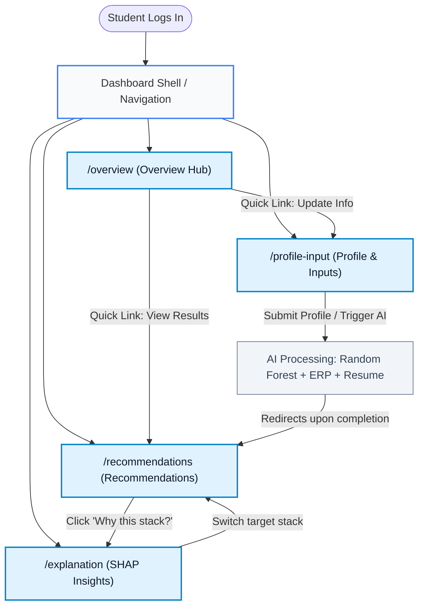

# Information Architecture — Student Tech-Stack Recommendation Dashboard

**Project:** AI-Based Tech-Stack Recommendation with ERP Integration (`SKIT/DS/2023-2027/CSE-F-096`)  
**Author:** Prachi Bhardwaj (Frontend Developer)  
**Sprint:** Sprint 1 — Dashboard Interface Planning & Design  
**Date:** September 2026  

---

## 1. Executive Summary & Dashboard Role

The Student Tech-Stack Recommendation Dashboard serves as the primary student-facing interface for the AI-guided career advisory platform. It bridges three core data sources — college ERP academic records, student-declared interests/skills, and parsed resume data — to deliver personalized, explainable technology stack recommendations.

The dashboard layout and route hierarchy are structured to cleanly map to the four frontend user stories owned across Sprints 1 through 4.

---

## 2. Page & Route Catalog

| Route Path | View / Page Name | Primary Purpose | Mapped Sprint & User Story |
|---|---|---|---|
| `/` or `/overview` | **Dashboard Shell & Overview** | Unified landing view displaying student snapshot, recommendation readiness status, quick summary metrics, and direct jump-off points. | **Sprint 1:** Dashboard Interface Planning & Design (Shell/Layout) |
| `/profile-input` | **Profile & Input Interface** | Interface for students to view synced ERP academic data, declare interest domains and self-assessed skills, and upload resumes for parsing. | **Sprint 2:** Student Input Interface Development |
| `/recommendations` | **Recommendation Results** | Displays AI-generated technology stack recommendations ranked by match score, with filters by domain, difficulty, and target industry roles. | **Sprint 3:** Recommendation Display Interface Development |
| `/explanation` | **Recommendation Explanation** | Transparent breakdown of *why* a specific tech stack was recommended, visualizing SHAP feature importance scores and ERP academic correlation. | **Sprint 4:** Recommendation Explanation Screen Design |
| `/settings` *(Utility)* | **Account & ERP Sync Status** | Utility view for viewing ERP connection parameters, sync timestamps, and application preferences. | *Supporting Utility / Non-blocking* |

---

## 3. Navigation Hierarchy

### 3.1 Nav Structure (ASCII Tree)

```text
Student Tech-Stack Dashboard
├── Global Topbar (Header)
│   ├── Platform Branding & Logo ("EduStack AI")
│   ├── ERP Sync Status Indicator ("Synced: SKIT ERP")
│   ├── Academic Session Pill ("B.Tech CSE-IoT | Sem 6")
│   └── Student Profile Avatar & Quick Menu
│
├── Persistent Sidebar Navigation
│   ├── [Nav Item 1] Overview (Home / Hub) ──────────────────────────► /overview
│   ├── [Nav Item 2] Profile & Skill Inputs (Data Entry & ERP) ─────► /profile-input
│   ├── [Nav Item 3] Recommended Stacks (AI Output Cards) ──────────► /recommendations
│   ├── [Nav Item 4] Explainability & SHAP (Insights & Factors) ────► /explanation
│   └── [Nav Item 5] System Settings / ERP Link ────────────────────► /settings
│
└── Main Content View (Dynamic Route Outlet)
    ├── View 1: Overview Dashboard
    │   ├── Welcome & ERP Profile Summary Card
    │   ├── Recommendation Pipeline Status (Readiness Stepper)
    │   ├── Key Metric Stat Cards (CGPA, Skills Count, Top Match, Readiness)
    │   ├── Quick Preview: Top Recommended Stack Banner
    │   └── Action Cards ("Update Skills", "View Explanations")
    │
    ├── View 2: Profile & Input Screen
    │   ├── Synced Academic Profile Section (Read-only ERP fields: Roll No, Branch, CGPA)
    │   ├── Career Aspirations & Preferred Domains Selector
    │   ├── Skill Self-Assessment (Technical skills, proficiency levels)
    │   ├── Resume Upload & Parsing Dropzone (Sprint 4 integration point)
    │   └── Submit & Trigger Recommendation Action Button
    │
    ├── View 3: Recommendation Results Screen
    │   ├── Filter & Sort Toolbar (Domain, Match Score, Learning Curve)
    │   ├── Primary Recommended Stack Card (Featured high-match recommendation)
    │   ├── Alternative Tech Stacks Grid (Secondary recommended options)
    │   ├── Tech Stack Breakdown (Frontend, Backend, Database, Cloud/DevOps tools)
    │   └── Deep-dive trigger ("View Why This Was Recommended" -> routes to /explanation)
    │
    └── View 4: Recommendation Explanation Screen
        ├── Selected Stack Context Banner
        ├── Overall Match Confidence Score Gauge
        ├── SHAP Feature Importance Waterfall / Contribution Bar Chart
        ├── Top Influencing Factors (Academic grade impact, Skill alignment, Course correlation)
        └── Skill Gap & Improvement Suggestions Panel
```

### 3.2 Navigation Flow Diagram (Mermaid)



---

## 4. User Journey & Sprint Mapping

### Step 1: Landing & Orientation (Sprint 1 Scope)
The student lands on the **Overview** page (`/overview`). The persistent sidebar gives direct one-click access to all features. The top header shows ERP connectivity status, reassuring the student that their college academic profile is loaded.

### Step 2: Input Submission & Verification (Sprint 2 Scope)
The student navigates to **Profile & Input** (`/profile-input`). They review their verified ERP metrics (Roll Number, Department, current CGPA, Semester) and enrich their profile with career interests, existing programming skills, and resume upload.

### Step 3: Recommendation Exploration (Sprint 3 Scope)
Once recommendations are calculated by the team's Random Forest model, the student navigates to **Recommendation Results** (`/recommendations`). They inspect top-ranked stacks (e.g., *Full-Stack Cloud Native*, *AI/ML Engineering*, *IoT Systems & Firmware*), review difficulty curves, and explore required tools.

### Step 4: Explainability & Educational Transparency (Sprint 4 Scope)
To comply with academic transparency and SDG 4 (Quality Education), the student clicks **Why this Stack?** or navigates directly to **Recommendation Explanation** (`/explanation`). They see SHAP-derived feature weights illustrating which inputs (e.g., high IoT marks, strong Python interest, completed DBMS coursework) drove the algorithm's verdict.

---

## 5. UI State & Fallback Rules

1. **Unsubmitted / Empty State (Fresh Student):**
   - Overview displays a guided onboarding banner prompting the student to verify ERP details and provide technical preferences.
   - Recommendation and Explanation tabs render friendly empty-state views (`EmptyState` component) directing the student back to the input step.
2. **Ready / Evaluated State (Populated Mock):**
   - Overview displays active scorecards and top match snippet.
   - Recommendations and Explanation tabs render populated cards and breakdown charts.
