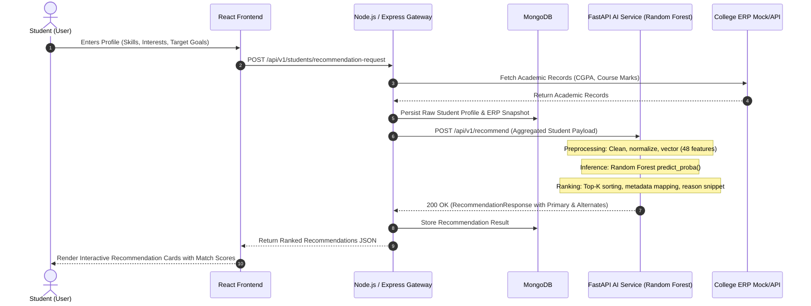

# System Architecture & Service Integration Specification

**Project Title:** AI Based Tech-Stack Recommendation with ERP Integration  
**Project ID:** SKIT/DS/2023-2027/CSE-F-096  
**Author:** Nishant Kumawat (Team Lead — AI/ML & System Integration)  
**Sprint:** Sprint 1 — Project Requirement Analysis & Architecture Finalization  
**Date:** August 2026  

---

## 1. Problem Analysis & Existing Systems

### 1.1 Problem Context
Selecting an optimal technology stack is one of the most critical decisions for undergraduate computer science and engineering students embarking on major projects, competitive portfolios, and career paths. Current approaches suffer from several limitations:
1. **Generic, One-Size-Fits-All Advice:** Students rely on generic internet roadmaps or peer opinions that ignore individual academic strengths and foundational coursework.
2. **ERP Data Siloing:** Institutional ERP systems store rich longitudinal records of student course performance, lab grades, and departmental specializations (e.g., IoT, AI/ML), but these records remain disconnected from career or technical guidance.
3. **Lack of Explainability:** When students receive recommendations, they rarely understand *why* a particular stack was chosen or what prerequisite gap they need to bridge.

### 1.2 Proposed System
The proposed solution introduces an intelligent, multi-tier recommendation platform that synthesizes:
- **Verified Academic Data (ERP):** Coursework marks, cumulative CGPA, branch specialization.
- **Student Profile & Technical Preferences:** Self-assessed skills, proficiencies, and interest domains.
- **Parsed Resume & Portfolio:** Extracted project history and verified tools.
- **Random Forest ML Engine:** Probabilistic ranking over structured technology stack archetypes.
- **FastAPI & Node.js Integration Layer:** High-performance microservice architecture with explainability and dashboard visualization.

---

## 2. High-Level System Architecture

```text
┌────────────────────────────────────────────────────────────────────────┐
│                        PRESENTATION TIER (UI)                          │
│     React.js + Tailwind CSS Dashboard (Prachi Bhardwaj)                │
│     - Overview Hub & ERP Snapshot                                      │
│     - Profile & Skill Assessment Input                                 │
│     - Ranked Tech-Stack Cards & Match Score Gauges                     │
│     - Explainability Visualizer                                        │
└───────────────────────────────────┬────────────────────────────────────┘
                                    │
                         HTTPS / REST API Requests
                                    │
                                    ▼
┌────────────────────────────────────────────────────────────────────────┐
│                      APPLICATION & GATEWAY TIER                        │
│     Node.js + Express API Gateway (Lakshya Jain)                       │
│     - Authentication & Session Validation                              │
│     - Student Profile Ingestion & Aggregation                          │
│     - ERP Connector Service                                            │
│     - Service Orchestration & Recommendation Dispatch                  │
│     - MongoDB Persistence (Profiles, Saved Recommendations)            │
└──────────────────┬─────────────────────────────────┬───────────────────┘
                   │                                 │
        Internal REST API (JSON)         Internal Microservice Call
                   │                                 │
                   ▼                                 ▼
┌──────────────────────────────────────┐  ┌──────────────────────────────┐
│            DATA PERSISTENCE          │  │       AI / ML SERVICE        │
│          MongoDB Database            │  │ Python + FastAPI (Nishant)   │
│  - Collections:                      │  │ - Feature Extraction Pipeline│
│    * `students`                      │  │ - Random Forest Classifier   │
│    * `erp_academic_records`          │  │ - Top-K Recommendation Engine│
│    * `recommendations_history`       │  │ - Tech Stack Taxonomy Catalog│
│    * `tech_stacks`                   │  │ - Explainability Readiness   │
└──────────────────────────────────────┘  └──────────────────────────────┘
```

---

## 3. Component Interaction & Data Flow



---

## 4. Subsystem Responsibilities & Team Matrix

| Subsystem | Technology | Lead Contributor | Core Responsibility |
|---|---|---|---|
| **AI Recommendation Model** | Python, scikit-learn, Random Forest | **Nishant Kumawat** | Feature engineering, model training, cross-validation, serialized artifact inference. |
| **AI Microservice API** | FastAPI, Pydantic, Uvicorn | **Nishant Kumawat** | REST endpoints (`/health`, `/api/v1/recommend`, `/api/v1/model-info`, `/api/v1/tech-stacks`). |
| **API Gateway & Backend** | Node.js, Express.js | **Lakshya Jain** | Gateway routing, MongoDB ODM, payload validation, ERP sync adapter. |
| **Frontend Dashboard** | React.js, Tailwind CSS | **Prachi Bhardwaj** | Interactive UI, recommendation display, profile inputs, score visualizations. |
| **Data & Quality Assurance** | Python, pandas, pytest | **Saloni Jain** | Data preparation coordination, unit testing, documentation validation. |

---

## 5. Security & Deployment Strategy

1. **Service Decoupling:** AI/ML compute is isolated in the Python FastAPI service, allowing independent scaling without burdening the Node.js API Gateway.
2. **Stateless AI Worker:** The FastAPI service operates statelessly, receiving all necessary features per request, enabling horizontal scaling behind a reverse proxy.
3. **Environment Security:** Configuration and port mappings are managed via environment variables without hardcoded paths or embedded secrets.
